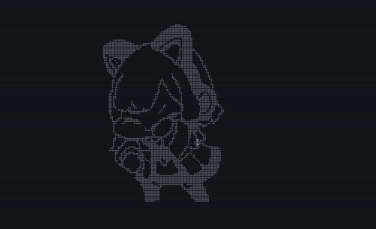

# momoisay-rs

Momoisay is a CLI program like cowsay, but instead of a talking cow, it's Saiba Momoi from Blue Archive!

Rewrite from [Mon4sm/momoisay](https://github.com/Mon4sm/momoisay).

## Preview

Preview of freestyle mode.



## Features

- Written in Rust!
- Talking ASCII art of Momoi
- Animated ASCII art of Momoi
- Freestyle changing animation of Momoi

## Installation

### Cargo

```sh
cargo install momoisay
```

### Nix

Quick usage (one-off)

```sh
nix run github:haruki-nikaidou/momoisay-rs -- say "Yuuka is 100kg"
```

Install with flake

```nix
{
  inputs = {
    momoi-say.url  = "github:haruki-nikaidou/momoisay-rs";
  };
}
```


```nix
{ pkgs, ... }: {
  home.packages = [ inputs.momoi-say.packages.${pkgs.system}.momoiSay ];
}
```

### Prebuilt Binaries

Pushing any git tag publishes stripped release binaries on the
[releases page](https://github.com/haruki-nikaidou/momoisay-rs/releases),
together with a `SHA256SUMS` file:

| Target | Notes |
| --- | --- |
| `x86_64-unknown-linux-gnu` | dynamically linked; requires glibc >= 2.39 (`readelf --version-info`) |
| `x86_64-unknown-linux-musl` | statically linked; no libc requirement |
| `aarch64-unknown-linux-gnu` | dynamically linked; requires glibc >= 2.39 |
| `aarch64-apple-darwin` | Apple silicon (M series) |

On older distros, use the musl build.

```sh
TAG=v0.1.0
TARGET=x86_64-unknown-linux-musl
tar -xzf "momoisay-${TAG}-${TARGET}.tar.gz"
install -Dm755 "momoisay-${TAG}-${TARGET}/momoisay" ~/.local/bin/momoisay
```

### Manually Build

```sh
git clone https://github.com/haruki-nikaidou/momoisay-rs.git
cd momoisay-rs
cargo build -r
```

## Usage

```
Usage: momoisay <COMMAND>

Commands:
  say        Display Momoi saying the provided text
  animate    Display an animated Momoi (variant 1 or 2)
  freestyle  Display Momoi in freestyle mode. Pretty cool for ricing btw
  help       Print this message or the help of the given subcommand(s)

Options:
  -h, --help     Print help
  -V, --version  Print version
```